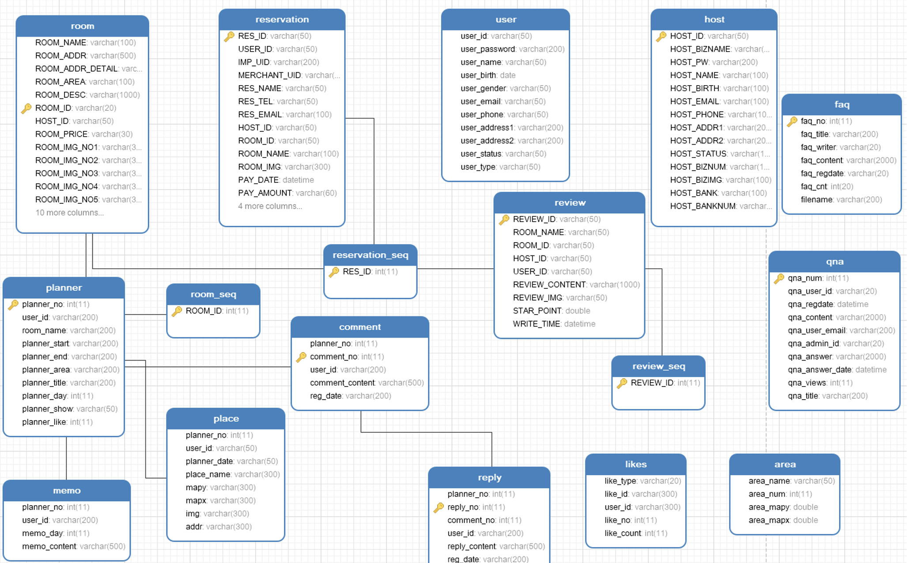
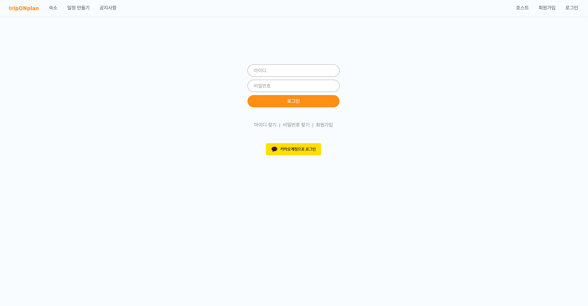
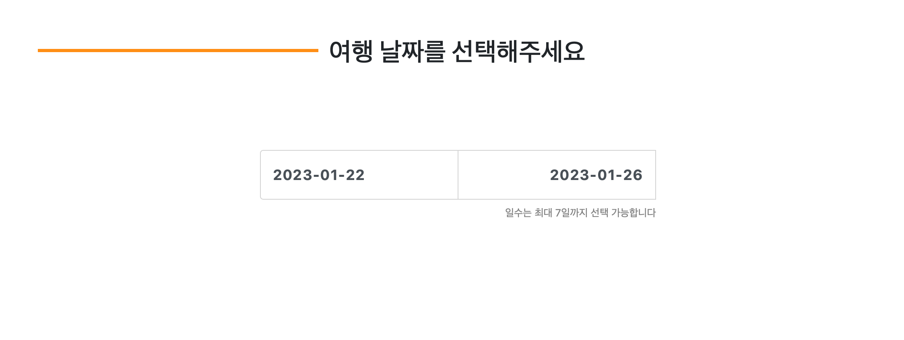
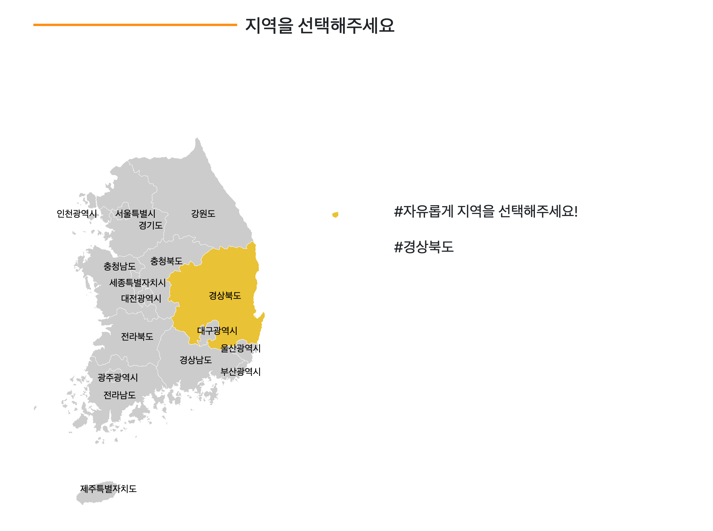
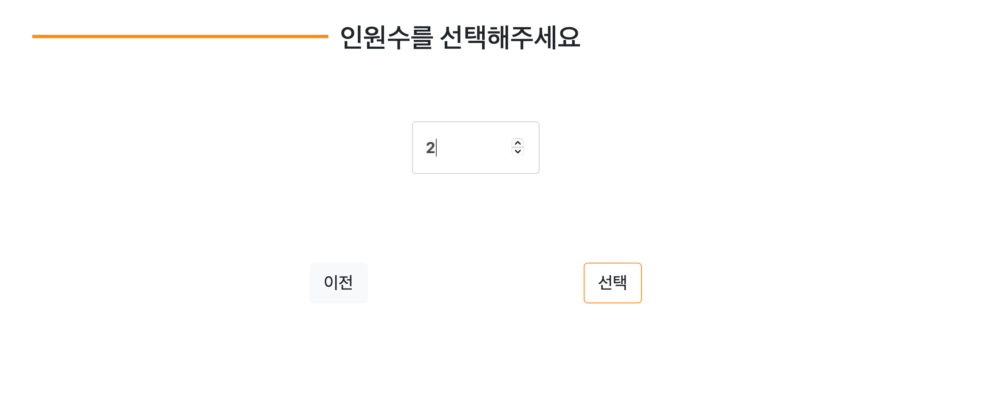
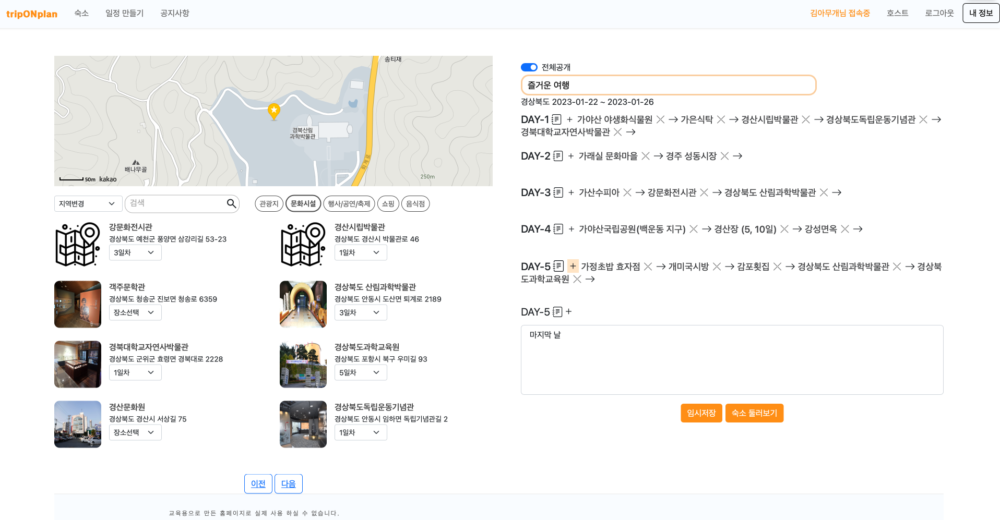
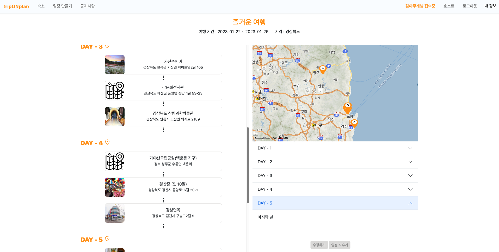
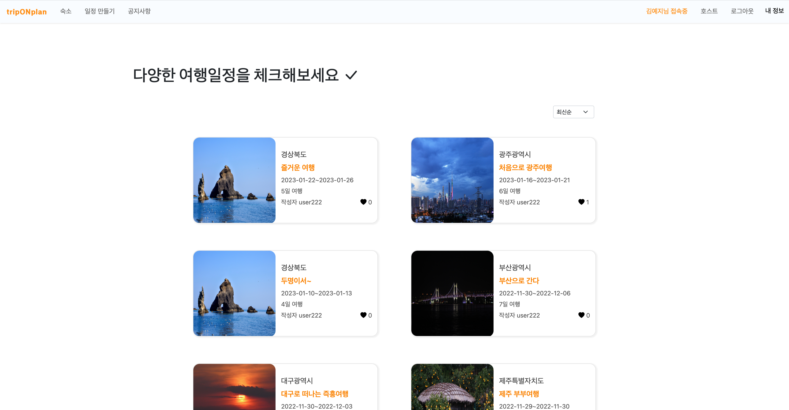
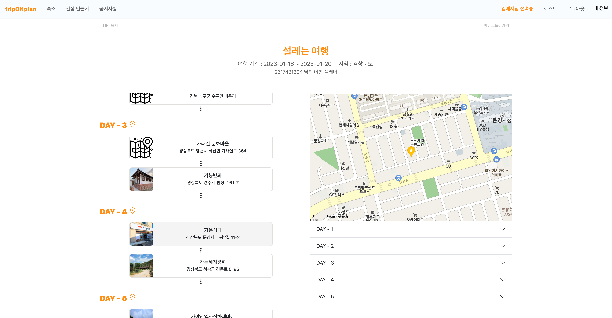
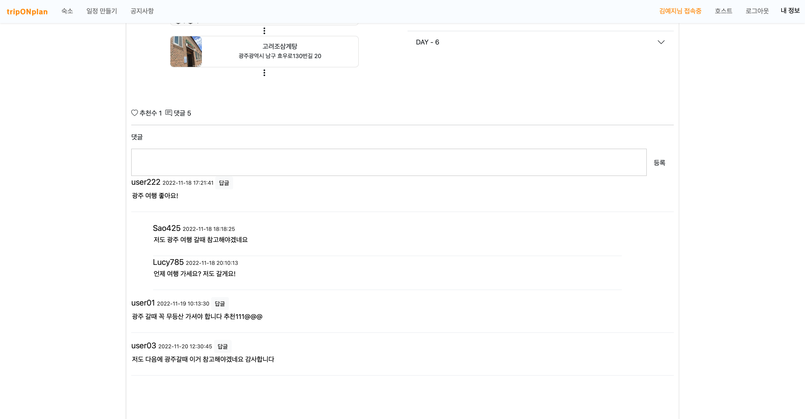

# TripOnPlan 

작업기간 : 2022-10-21 ~ 2022-11-18 

총 인원 : 7명

프로젝트 설명 : 숙박 예약 서비스와 여행 일정 만들기를 한 번에 이용할 수 있는 여행 사이트 

담당 역할 : 사용자의 여행 일정 관리 서비스 / 메인 페이지 디자인

주소 : www.triponplan.kro.kr:8080/biz

사용자 아이디 : user222 비밀번호 : 1111 (회원가입,카카오 소셜 로그인 가능)

---

### 개발 일정 🗓️

1.  1 주차 - 주제선정 , 주제 관련 사이트 참고 , 프로토타입 제작 , 역할 분담 
2.  2주차 - 기능구현
3.  3주차 - 기능구현 , 프론트 작업 , 테스트 
4.  4주차 - 도메인 추가 , 최종 통합 

### 개발 환경 🖥️

**FRONT** - HTML/CSS/JS AJAX Bootstrap 

**BACK** - java8 Spring MyBatis Apache Tomcat MariaDB

**API** - TourAPI coolSMS kakao Import 

**TOOL** - Spring Tool Suite 3 visual studio code GitHub

### 프로젝트에 적용한 데이터 베이스 구조표 (ERD) 📌

### 사이트 주요 UI / UX

메인 페이지

로그인 페이지

일정 정보 입력 페이지 

1. 날짜 입력

2. 지역 선택 

3. 인원수 선택 

정보 입력 기반으로 일정 등록 페이지 이동 

☑️ 총 5가지 카테고리로 명소 등록이 가능함  

☑️ 일자별로 메모 할 수 있음 

☑️ 지역을 변경하여 해당 지역의 명소 검색 , 등록 가능 

☑️ 전체공개 비공개 여부를 선택하여 여행 일정을 공유 할 수 있음

사용자의 여행 일정 확인 페이지 

전체공유 한 이용자의 플래너 리스트

플래너 상세 보기 페이지 

좋아요 댓글 대댓글 기능 

